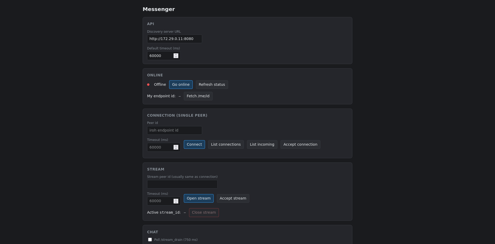
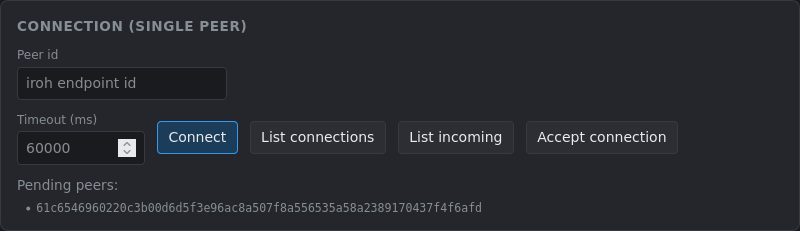
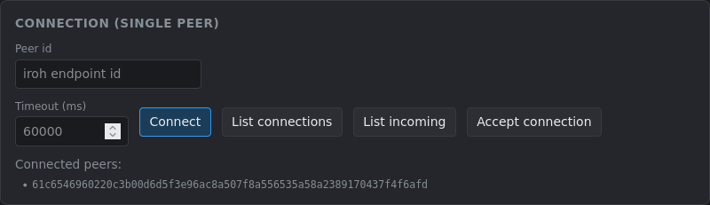
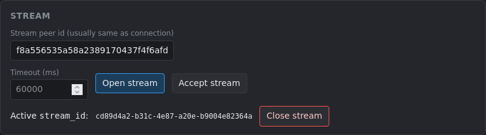
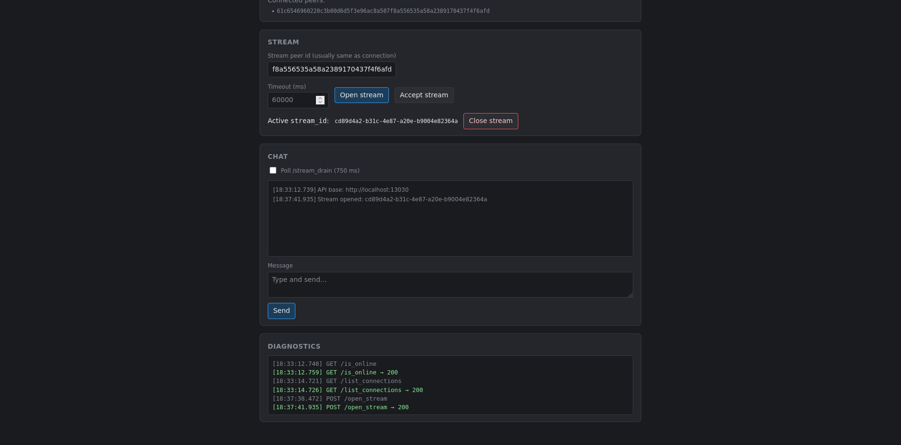
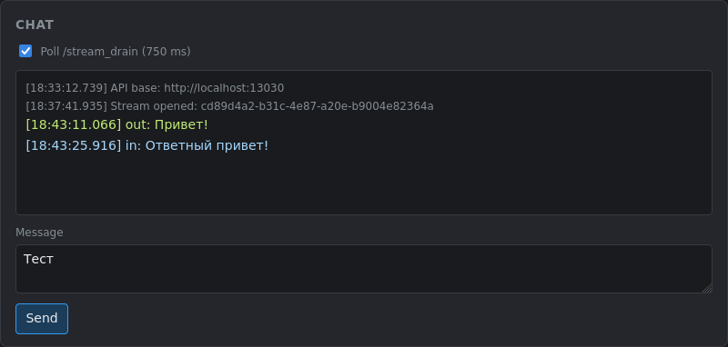

# Discovery System

## Требуемые инструменты

Для кодогенерации из OpenAPI спецификации в проекты используется утилита [oas3-gen](https://github.com/eklipse2k8/oas3-gen). Перед сборкой и началом разработки её необходимо установить.

Установка через cargo:

```sh
cargo install oas3-gen
```

Среда разработки для пользователей Nix:

```sh
nix develop
```

## Запуск проекта

Для запуска кластера из 5 серверов и 2 клиентов используется Docker Compose:

```sh
docker compose -f docker/docker-compose.yaml up --build
```

### Уровни логирования

По умолчанию сервисы используют уровень логирования `info`. Для включения уровней `debug` и `trace` можно использовать override-файлы:

```sh
docker compose -f docker/docker-compose.yaml -f docker/overrides/<debug или trace>.yaml up
```

### Адреса и порты

Серверы имеют адреса от 127.29.0.11 до 127.29.0.15 внутри сети docker и принимают входящие соединения на порте от 8080. На хосте они доступны на портах от 18080 до 18084 соответственно. 

Клиенты имеют адреса 127.29.0.21 и 127.29.0.22 внутри сети docker и принимают входящие соединения на порте 3030. На хосте они доступны на портах 13030 и 13031 соответственно.

## Веб-интерфейс (Мессенджер)

Для удобства тестирования клиенты предоставляют веб-интерфейс по адресам http://localhost:13030 и http://localhost:13031 соответственно.



### Настройка подключения

В поле "Discovery server URL" необходимо указать URL сервера, которым будет пользоваться клиент. В примере на изображении это http://172.29.0.11:8080 (нужен адрес во внутренней сети docker).

Поле "Default timeout (ms)" определяет timeout для запросов к серверу. По умолчанию 60 секунд, но его можно переопределить для каждой операции отдельно.

### Статус и идентификация

В секции **Online** можно узнать статус подключения к серверу. В режиме "Online" клиент начинает получать данные с сервера о входящих соединениях. После перехода в статус "Online" можно получить свой ID для соединения с другим клиентом.

### Управление соединениями

В секции **Connection** можно просмотреть входящие запросы на соединение, активные соединения, а также инициировать или принять соединение.





### Потоки данных

В секции **Stream** можно открыть поток данных в рамках одного из активных соединений. Для этого на одной стороне необходимо начать ожидания входящего потока, а на другой стороне открыть его. В веб-интерфейсе есть ограничение на один одновременно открытый поток.



### Обмен сообщениями

В секции **Chat** находится простой интерфейс для обмена текстовыми сообщениями в рамках активного потока.



Переключатель "Poll /stream_drain" включает автоматическое получение новых сообщений с сервера-клиента. Когда он выключен, сообщения копятся на сервере.



### Диагностика

Ниже находится диагностическое окно, в котором выводится информация о выполняемых запросах.